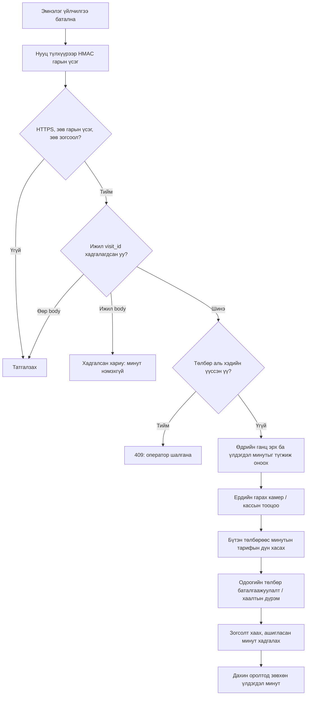

# Эмнэлгийн өдрийн хөнгөлөлтийн API

Энэ холболт эмнэлгээр үйлчлүүлсэн машины дугаарт хөнгөлөлт олгоно. Төлбөр
баталгаажуулах, wallet цэнэглэх, хаалт нээх эрх олгохгүй. Шинэ суулгалт зогсоол
автоматаар сонгохгүй, холболт идэвхжүүлэхгүй.

## Төлбөрийн дүрэм

- Өдөр = Улаанбаатарын цаг (UTC+8), тухайн зогсолтын **орсон өдөр**.
- Нэг дугаар, нэг зогсоол, нэг өдөрт анхдагч 120 минут. Дахин орж гарсан ч
  ашиглаагүй минут л үлдэнэ. Өөр эмнэлгийн холболт/visit_id лимит нэмэхгүй.
- Төлбөр = бүтэн зогсолтын төлбөр − ашиглах үнэгүй минутын тарифын мөнгөн дүн,
  хамгийн багадаа 0₮. Жишээ: 180 минут 5,000₮, 120 минут 2,000₮ бол 3,000₮.
  Тарифын үнэгүй минут, НӨАТ-ын горимыг хоёр тооцоонд ижил хэрэглэнэ.
- Жишээ: эхний зогсолт 60 минут, хоёр дахь 90 минут бол 60 + 60 минутын
  хөнгөлөлт хэрэглэж, гурав дахь зогсолт ердийн тарифаар явна. Хөнгөлөлтийн
  **минут** нийлдэг; өдөржин хэрэглэх тогтмол мөнгөн түрийвч биш.
- Дотор талбайд зогссон, төлбөрөөс өмнө нь хассан хугацааг дахин хэрэглэхгүй.
  Төлбөрийн дэлгэцийг дахин уншихад минут зарцуулахгүй. Зогсолт хаагдахад
  хэрэглэсэн минутыг хадгалж, үлдэгдлийг дараагийн оролтод шилжүүлнэ.
- Хаагдсан зогсолтыг дахин нээхэд шилжүүлсэн минутыг буцаан ашиглахгүй.
  Гарцын хугацаа нотлогдоогүй хаалтаар лимитийг таамгаар суллахгүй.
- Шөнө дунд давсан зогсолт орсон өдрийн лимитээ хэрэглэнэ. Дараагийн өдрийн
  шинэ оролтод шинэ эмнэлгийн баталгаажуулалт шаардлагатай. Өмнөх өдөр эхэлсэн
  идэвхтэй зогсолтод өнөөдрийн баталгаажуулалт ирвэл 409 буцаана.
- Лимит өөрчилбөл аль хэдийн олгосон өдрийн лимит хэвээр. Түүхэн төлбөр,
  өр, баримтыг өөрчлөхгүй, буцаан олголт автоматаар хийхгүй.

## Админы тохиргоо

Тохиргоо → Холболт → Эмнэлгийн хөнгөлөлт:

1. Холболтын нэр, минутын лимитийг хадгална. Super Admin зогсоол оноохгүй
   хадгалж болно; тухайн зогсоолын админ өөрийн эрхтэй зогсоолыг сонгоно.
2. Холбох зогсоолыг сонгоно. Нэг түлхүүр нэг зогсоолд үйлчилнэ.
3. API түлхүүр үүсгээд эмнэлгийн **серверийн нууц тохиргоонд** хадгална.
   Зөвхөн нэг удаа харагдана. Browser/app код, URL, логт оруулахгүй.
4. Эмнэлгийн хөгжүүлэгчид integration ID, site_code, HTTPS endpoint өгнө.
5. Туршилтыг test орчинд баталсны дараа холболтыг идэвхжүүлнэ.

Түлхүүр солиход хуучин түлхүүр тэр даруй хүчингүй болно. Идэвхгүй болговол
шинэ баталгаажуулалт хүлээж авахгүй; өмнө олгосон хөнгөлөлт хэвээр. Түлхүүртэй
холболтыг өөр зогсоол руу шилжүүлэхгүй; шинэ холболт үүсгэнэ. Test/production
тусдаа түлхүүртэй. Админ нь `settings` эрх, ADMIN/SUPER_ADMIN үүрэг болон
зогсоолын хамрах хүрээг зэрэг хангасан байна.

Серверийн `PARKING_SECRET_ENC_KEY` хүчинтэй Fernet түлхүүр байх ёстой.
Шифрлэгдсэн DB болон түлхүүрийн нөөцийг тусад нь хамгаална. Түлхүүрийг алдах,
сольж дарах нь хадгалсан холболтуудыг тайлж унших боломжгүй болгоно.

## Хүсэлт

`POST /api/v1/hospital/visits` — HTTPS, `Content-Type: application/json`.
Бие хамгийн ихдээ 4096 byte. Өвчтөний нэр, регистр, онош хүлээж авахгүй.

```json
{
  "visit_id": "hospital-opaque-visit-20260922-001",
  "site_code": "HOSPITAL_SITE",
  "plate_number": "1234УБА",
  "served_at": "2026-09-22T15:20:00+08:00"
}
```

| Талбар | Шаардлага |
|---|---|
| visit_id | Тухайн эмнэлгийн давтагдашгүй, хүний мэдээлэл агуулаагүй ID; 1–100 ASCII үсэг/тоо/`_.:-` |
| site_code | Түлхүүрт оноосон идэвхтэй зогсоолын яг код |
| plate_number | Яг canonical дугаар: `1234УБА`; том кирилл үсэг, ASCII цифр, зайгүй; дипломат `ДК1234` / `1234ДК`, `1234АК` дэмжинэ |
| served_at | Цагийн бүстэй ISO 8601; өнөөдрийн үйлчилгээ, ирээдүй рүү хамгийн ихдээ 5 минут |

QR/картын төлбөр үүсгэхээс **өмнө** баталгаажуулна. Идэвхтэй зогсолтгүй
байхад өдрийн эрх бүртгэж болно; дараагийн бодит оролт үлдэгдлийг хэрэглэнэ.
Хуучин камерын логийг нөхөж үүсгэсэн зогсолтод өмнө олгоогүй эрхийг ухрааж
оноохгүй. Камер дугаарыг өөрөөр уншсан бол хөнгөлөлт буруу машинд очихоос
сэргийлж яг дугаарын тохирол шаардана.

## Гарын үсэг

Толгой: `X-Hospital-ID` (жижиг үсэгтэй canonical UUID), `X-Hospital-Timestamp`
(Unix seconds), `X-Hospital-Signature` (64 жижиг hex тэмдэгт).

Гарын үсгийн оролт нь доорх **6 мөр**, мөр хооронд LF (`\n`), төгсгөлийн
LF байхгүй. Биеийн hash нь яг илгээх UTF-8 byte-уудын SHA256 hex байна.

```text
hospital-v1
<X-Hospital-ID>
<X-Hospital-Timestamp>
POST
/api/v1/hospital/visits
<sha256(raw_body)>
```

`HMAC-SHA256(key=UTF8(signing_secret), message=UTF8(дээрх мөрүүд))`-ийн hex
утгыг signature толгойд өгнө. Түлхүүр нь дэлгэцээс авсан мөрийн яг UTF-8
утга; Base64 болгон дахин тайлахгүй. Серверийн цагтай зөрүү ±300 секунд.
NTP синхрончлол хэрэгтэй. [Python жишээ](../examples/hospital_client.py).

Энэ нь өөрийн хувилбартай HMAC протокол; RFC 9421-ийн wire format биш.
Загварын үндэслэл: [OWASP REST Security Cheat Sheet](https://cheatsheetseries.owasp.org/cheatsheets/REST_Security_Cheat_Sheet.html),
[RFC 9421 §7](https://www.rfc-editor.org/rfc/rfc9421.html#section-7).

## Хариу, дахин оролдлого

Амжилт: 200, `status=GRANTED`, `grant_id`, `benefit_date`, `daily_minutes`,
`attached_to_current_stay`, `replayed`. 200 нь төлсөн эсвэл хаалт нээгдсэн гэсэн
үг биш. `daily_minutes` нь нийт лимит болохоос үлдэгдэл минут биш.

| HTTP | Үйлдэл |
|---|---|
| 401 | Түлхүүр/идэвхжил/гарын үсэг/серверийн цагийг шалгана |
| 403 | Зогсоолын код, түлхүүрийн хамрах хүрээг шалгана |
| 409 `RETRY_SAME_VISIT_ID`, `HOSPITAL_ALLOWANCE_BUSY` | Өмнөх **яг body, visit_id**-аар хязгаартай backoff; шинэ timestamp/signature үүсгэж болно |
| 409 `VISIT_ID_CONFLICT` | ID-г өөр мэдээлэлтэй дахин ашигласан; автоматаар шинэ ID зохиож дахин илгээхгүй |
| 409 `PAYMENT_IN_PROGRESS_OR_PAID`, `STAY_NOT_ELIGIBLE` | QR/төлбөр аль хэдийн үүссэн; операторын хяналт, төлбөрийг дахин бүү нэхэмжил |
| 409 `STAY_STARTED_ON_ANOTHER_DAY` | Өмнөх өдрийн идэвхтэй зогсолтыг оператор шалгана |
| 422 | Формат/үйлчилгээний өдөр буруу; эх мэдээллийг засна |
| 429 | `Retry-After`-ийн дараа хязгаартай retry |
| Timeout / 5xx | Үр дүн тодорхойгүй; ижил ID, яг body хадгалж retry хийнэ |

Ижил ID + яг ижил бие дахин ирвэл хадгалсан хариуг өгч `replayed=true`
болгоно. Минут дахин нэмэхгүй. `served_at`-ийг retry бүрд өөрчилж болохгүй.
Дараагийн өдөр үйлчилгээ шинээр авсан бол шинэ visit_id шаардлагатай.
Rate limit одоогийн нэг worker-д IP 120/min, түлхүүр 60/min; олон worker
болгохын өмнө нийтлэг rate-limit хадгалалт шаардлагатай.


