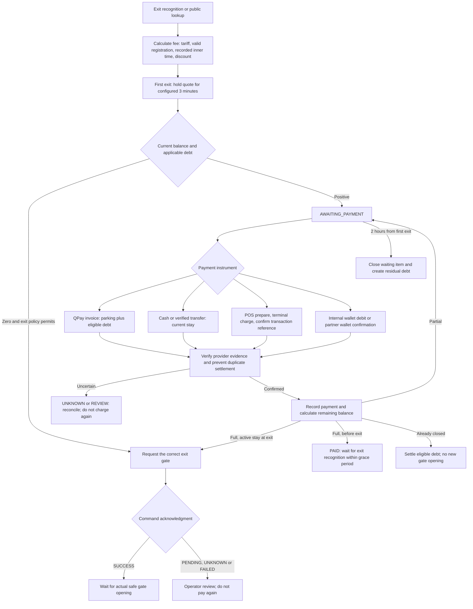
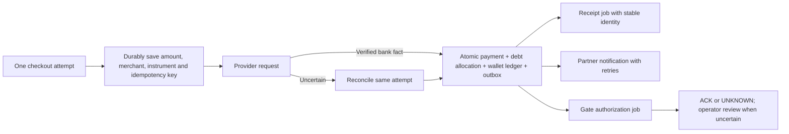

# Payment flow audit — 2026-09-19

Scope: parking checkout, public QR, cashier cash/transfer, POS, internal and partner wallets, wallet top-up, debt collection, receipts and exit commands. This is a source and regression-test audit. It does not certify a bank transaction, the installed POS client, an external wallet contract, or physical gate movement.

## Changes in this release

- Show the existing inner-time limit for both same-site inner cameras and separate nested sites. `0` means all recorded inner time; empty inherits the global rule. The release itself does not change saved site policies.
- Return settlement balance and gate-command outcome for QPay checks, cash, transfer and partner wallet responses. A paid transaction can be partial, late, or accompanied by an unsuccessful gate command. The UI now distinguishes these outcomes.
- Scope public debt totals to the same merchant scope used by the QPay invoice. Previously the public page could show another merchant's debt.
- Allow a QPay invoice when parking is free but eligible previous debt remains. Previously `_create_payment` rejected this before considering debt.
- Remove the public page's silent second invoice-creation request after an uncertain response. Keep explicit reconciliation guidance.
- Label cashier totals accurately: QPay can include previous debt; cash/transfer buttons collect the current stay, with prior debt collected separately.

## Current parking checkout

The 3-minute price hold and the post-payment exit grace period are different rules. After the price hold expires, the total parking duration is recalculated; the hold is not a free-time deduction. Repeated reads do not extend the first wait indefinitely. A bank transaction made against an older invoice can leave a genuine residual; already collected money must be subtracted rather than invoiced twice.

`Payment.status=PAID`, a zero session balance, `BarrierCommand.status=SUCCESS`, and the physical gate position are separate facts. The device ACK is not a physical position sensor. The backend persists closure before device I/O, so `CLOSED` also does not independently prove departure.

## Instruments and exception branches

| Path | Evidence and safeguards present | Limits / follow-up |
|---|---|---|
| QPay parking | Persistent creation intent, reuse compatible pending invoice, server-side payment check, row locks, residual/late-payment handling | Provider cancellation races and uncertain creation need reconciliation. Extra money is not automatically refunded. |
| Cash | Cashier/site authorization, expected amount, retirement of an old QR before recording payment | Operator must actually receive the cash. Current-stay amount only. |
| Transfer | Additional transfer permission, expected amount and operator confirmation | Manual bank-statement verification; no automatic bank-feed proof. |
| POS | Prepare before charge, terminal/site authorization, unique transaction reference, idempotent repeat confirmation | The deployed terminal application must actually use prepare/confirm. Its binary and real transaction were not inspected here. |
| Internal wallet | Same payment/finalization path; wallet/session locks; balance and ledger update in the settlement transaction | Partial debit rounds to whole currency while the wallet supports decimal amounts; see remaining findings. |
| Partner wallet | Intent, pay permission, partner/site scope, unique transaction reference, common settlement, uncertain debit blocks another attempt | `/balance`, `/debit`, `/credit` adapter contract needs comparison with the actual provider specification. Async partner notifications are not durable. |
| Wallet top-up | Separate `WALLET_TOPUP` payment; verified callback and locked, idempotent ledger credit | Invoice intent and background recovery have gaps described below. Top-up itself does not open a gate or issue a consumption receipt. |
| Previous debt | Eligible debt can join QPay; separate cashier debt collection and privileged write-off | Separate debt payment does not yet use the same reservation/locking safeguards as parking checkout. Writing off a debt is not a bank refund. |
| Receipt | Receipt failure is distinct from payment failure; failed receipts can be investigated | External receipt work still occurs inside parts of settlement. Process-crash recovery should use durable jobs. |

Wallet is connected as a payment instrument in the shared payment ledger and settlement code. That is not evidence that every external wallet provider is operational, nor does it imply a wallet button exists on every checkout screen.

## Remaining findings, not changed by this release

| Priority | Finding / trigger | Source | Required next step |
|---|---|---|---|
| P1 | Top-up invoice creation flushes but does not commit its intent before calling QPay. A timeout rolls the local row back although the provider may have created an invoice. | `backend/app/routers/wallet_router.py::public_wallet_topup` | Persist a unique top-up attempt before I/O, retain UNKNOWN results, reuse/reconcile attempts, test timeout and duplicate-click cases. |
| P1 | Background QPay recovery selects all PENDING QPay kinds but dispatches to parking `_confirm_qpay`. Sessionless wallet top-ups require `_verify_and_credit` instead. | `backend/app/services/qpay_recheck.py::run_once` | Dispatch by payment kind and add missed-callback top-up tests; never mark paid without checking the bank. |
| P1 | Standalone debt collection reads PENDING without a row lock, and writes Payment only when a session exists. Concurrent collection and sessionless debt need separate regression coverage. | `backend/app/routers/compensations_router.py::pay_compensation` | Lock/recheck debt, use stable collection identity, record sessionless financial facts and verify card transaction evidence. |
| P2 | QPay recovery examines the newest 20 eligible invoices, only within 24 hours. Sustained traffic can repeatedly exclude older items. | `backend/app/services/qpay_recheck.py::run_once` | Durable retry scheduling with bounded, fair batches and an older-item reconciliation queue. Do not assume old PENDING means unpaid. |
| P2 | Internal partial wallet debit uses `round(take)` for Payment while wallet/ledger can retain cents. | `backend/app/session_logic.py::_wallet_auto_deduct` | Use the same exact Decimal amount for balance, ledger and Payment; test fractional balances. |
| P2 | Receipt HTTP work and fire-and-forget partner notifications do not form a durable post-settlement queue. | `payments_router.py::_finalize_paid`, `integration_router.py::confirm_payment` | Short atomic settlement plus an outbox for receipt/partner delivery; independently idempotent gate command handling. |
| Acceptance | External wallet API behavior, POS client adoption, real bank settlement and physical relay operation are not established by mock tests. | Provider adapters and terminal endpoints | Provider contract tests, isolated acceptance, then a supervised real transaction with reconciliation. |

These are source findings, not assertions that each failure has already occurred in production. Historical balances were not repaired or recalculated by this release.

## Recommended settlement architecture — future work

Provider facts must be accepted idempotently even if the browser is closed. Settlement should commit before optional receipt delivery. A gate timeout must not cause another charge. Unknown physical effects must not be blindly replayed.

This recommendation matches published webhook guidance on duplicate delivery and asynchronous processing: [Stripe webhook documentation](https://docs.stripe.com/webhooks). QPay's own merchant contract remains authoritative for QPay-specific fields and checks: [QPay Merchant API](https://developer.qpay.mn/mn/docs/merchant?version=2.0.0). The QPay documentation page was indexed but returned an HTTP 500 during this audit, so no unverified new QPay endpoint is assumed here.

## Validation and rollout

New regressions cover partial-paid response metadata, zero-parking/debt-only invoicing and merchant-scoped public debt. Frontend tests cover seven payment outcomes and render the real settings component for same-site, nested and ordinary sites. CI builds the frontend and runs these tests; PostgreSQL CI exercises the existing financial/migration suite.

Deployment requires the exact reviewed commit, isolated database restoration, passing CI, a fresh backup, staged frontend assets, and rollback. Do not enable automatic deployment or infer a successful release merely from passing unit tests. Operational evidence and private backup paths belong in the operator's local report, not this public document.
