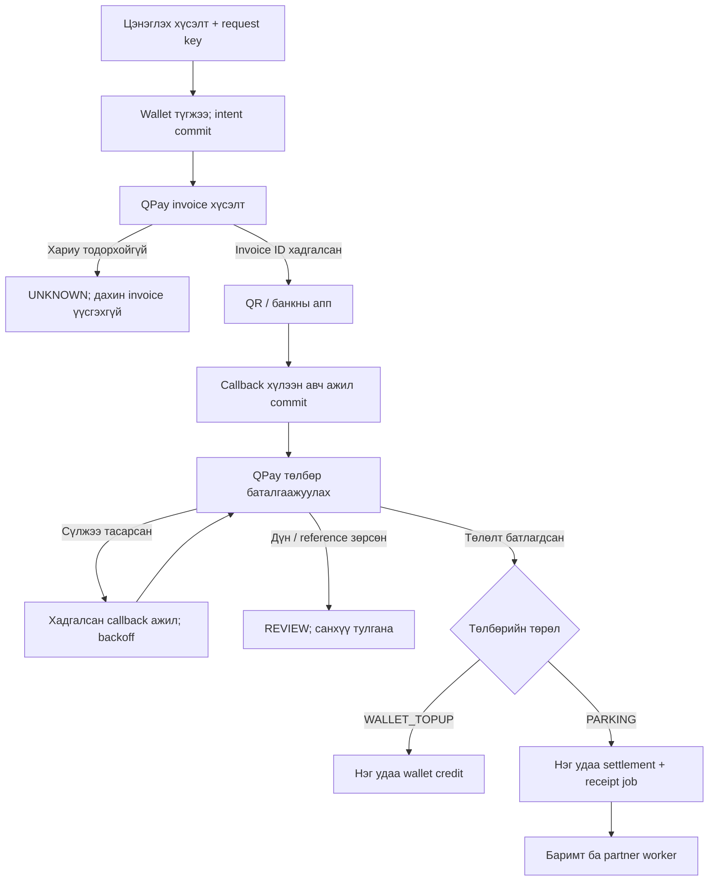

# Төлбөрийн найдвартай байдлын засвар

Энэ хувилбар нь `fb816b2c` дээр нэмэгдэх засвар. Production-д суусан эсэхийг зөвхөн серверийн `DEPLOY_OK`, schema, HTTPS шалгалтын үр дүнгээр батална.

| Олдвор | Хэрэгжүүлсэн хамгаалалт |
|---|---|
| Wallet top-up timeout | Wallet мөрийг түгжиж, оролдлого ба callback token-ийг QPay хүсэлтээс **өмнө commit** хийнэ. Нэг request key нэг оролдлогыг заана. Timeout/malformed response → UNKNOWN. Тасарсан CREATING 10 минутын дараа UNKNOWN; шинэ invoice давтан үүсгэхгүй. |
| Wallet нөхөн баталгаажуулалт | WALLET_TOPUP → wallet credit; PARKING → parking settlement. Дүн, банкны reference шалгаж, reference-ийн unique key болон Payment/Wallet түгжээгээр давхар credit-ээс хамгаална. |
| Тусдаа өр | Pay/cancel/write-off нэг Compensation мөрийн түгжээг ашиглана. Зогсолтгүй өр ч Payment(DEBT), site, кассын ээлж, баримтын ажилтай болно. CARD нь бүртгэлтэй тухайн зогсоолын терминал ба давтагдаагүй transaction ID шаарддаг. |
| Хуучин QPay | Callback-ийн баталгаажуулалтын ажил санд хадгалагдана. Сүүлийн болон хуучин ажлыг хольж, хамгийн удаан хүлээсэн due ажлыг авна; 24 цагийн cutoff байхгүй. |
| Бутархай wallet | Payment, WalletLedger, wallet balance нэг Decimal дүн ашиглана. |
| Баримт / түнш | Төлбөр ба FinancialJob нэг транзакц. Worker commit хийсний дараа HTTP явуулна; lease, тогтвортой request key, retry backoff, тодорхойгүй үр дүнг тусгаарлах төлөвтэй. EV settlement мөн энэ замаар явна. |

## QPay-ийн баталгаажуулалтын дүрэм

Хэрэглэгч тусгай polling гэрээний нөхцөл мэдэхгүй гэж тодруулсан. Иймээс [Merchant V2](https://developer.qpay.mn/mn/docs/merchant?version=2.0.0), [eBarimt 3.0](https://developer.qpay.mn/mn/docs/ebarimt-3-0?version=3.0.0)-ийн нийтэд нээлттэй зааврыг баримтална: callback авсны дараа `/v2/payment/check` ашиглана; invoice бүрийг cron-оор байнга шалгахгүй.

Дэлгэцийн polling нь зөвхөн локал DB төлөв уншина. Callback баталгаажуулах HTTP тасарсан бол хадгалсан ажлыг хамгийн ихдээ 8 удаа нөхнө. Нэг pass ≤20, хүсэлтийн хооронд ≥0.5 секунд, backoff ≤1 цаг нь **манай хамгаалалтын хязгаар**, QPay-аас тогтоосон баталгаатай quota биш. Амжилттай хариу ирмэгц (төлсөн эсвэл төлөөгүй гэсэн хариу) тухайн callback-ийн ажлыг дуусгана.

Callback огт ирээгүй хуучин PENDING-ийг төлөөгүй гэж дүгнэхгүй. `/api/reports/financial-work` эрх/зогсоолын хүрээнд тулгах жагсаалт өгнө. QPay statement, merchant dashboard эсвэл provider-ийн баталгаатай мэдээлэлтэй тулгах шаардлага хэвээр. Invoice үүсгэх хариу алдагдсан үед дэмжигдсэн lookup API-г таамаглан ашиглаагүй.

## Баримт ба мэдэгдлийн баталгаа

- QPay/PosAPI receipt CREATE-ийн давтан хүсэлт аюулгүй гэсэн баталгаа олдоогүй. Timeout эсвэл worker тасарвал UNKNOWN/REVIEW; автоматаар хоёр дахь CREATE хийхгүй.
- msgbill адаптерийн баримтжуулсан ижил key/ижил body дүрмээр нөхнө. Provider ID авсан бол зөвхөн GET; 404/FAILED дээр шинэ key зохиохгүй. Хуучин тодорхойгүй баримтанд provider reference байхгүй бол санхүүгийн тулгалт шаарддаг.
- Partner POST нь at-least-once. Ижил event ID болон `Idempotency-Key` дахин ашиглана; хүлээн авагч мөн давхардлыг таних ёстой. `payment.paid`-ийн дараа баримт гарвал тусдаа `receipt.ready` event хадгална. Partner нь `GET /api/v1/payments/{id}`-аас одоогийн төлөвийг авч болно.
- Retry боломжтой receipt/partner ажил хамгийн ихдээ 24 оролдлогын дараа REVIEW/UNKNOWN-д үлдэнэ. Нууц/token/HTTP response body санхүүгийн ажлын API-д буцаахгүй.
- msgbill одоогийн адаптер бүхэл төгрөг илгээдэг. Бутархай дүнг чимээгүй дугуйлан буруу баримт болгохгүй; тулгалтад үлдээнэ. Payment, wallet, ledger-ийн жинхэнэ дүн хэвээр.
- CARD өр төлөлтийн reference нь операторын бүртгэл; банкнаас мөнгө суутгах команд эсвэл автомат банкны баталгаа биш.
- Баримтын retry нь төлбөр дахин авахгүй, хаалтын команд дахин явуулахгүй. Хуучин санхүүгийн мөрүүдийг migration засварлахгүй.

## Release шалгуур

CI: unit, PostgreSQL 16/18.6 concurrency + migration replay, frontend build/tests, security. Дараа нь production backup-ийг тусдаа DB-д сэргээж, migration өмнө/дараах санхүүгийн нийлбэр ба тохиргоог тулгана. Candidate-д additive schema шаардлагатай. Rollback нь шинэ санхүүгийн мөрийг хуучин backup-аар дарж устгах ёсгүй; өргөтгөсөн хүснэгт/багануудыг хадгална. Автомат deploy хэвээр disabled.
